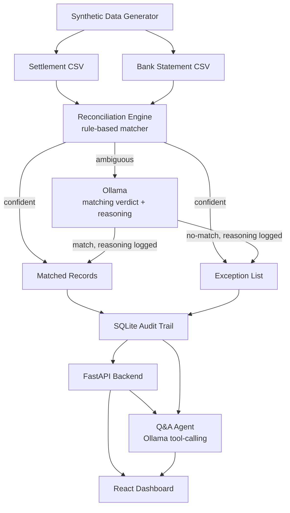

# AI Finance Controller

**Razorpay Individual Hackathon — Track 04, AI Finance Controller**
**Status: v1.0 complete** (Phases 0–8 of `project_plan.md`); v2.0 in
progress — Phases 9 (test suite & backend hardening), 10
(human-in-the-loop resolution), and 11 (richer dashboard) done, see
`project_plan_v2.md`.

An agent that closes one finance-ops loop: reconciling Razorpay settlement
data against a bank statement across a 50+ record batch, and letting a
finance-ops user ask it plain-language questions about the results.

## The problem

Two of the track's example directions, combined:

1. **Multi-source reconciliation** — match transactions across settlement
   and bank records, report a match rate, and produce an honest list of
   exceptions (records that couldn't be auto-matched) — not a cherry-picked
   demo, and not force-matched to look better than it is.
2. **Settlement Q&A agent** — a chat layer on top of that output, so a
   finance-ops user can ask *"why is today's payout short?"* and get an
   answer sourced from the actual data, not a guess.

The bar (from the track brief): throughput across the full batch, measured
accuracy honestly reported, and an honest exception list left for human
review rather than papered over.

## Architecture



**Rules first, Ollama for the ambiguous middle.** Exact reference_id/amount/
date matches, and fuzzy matches within tolerance (date ≤2 days, amount
≤₹10), resolve deterministically via rules — no LLM involved, no
non-determinism. Records the rules can't confidently call — corrupted
reference IDs, larger date drift, but still with real evidence in the bank
narration — go to Ollama, which reasons over both records and returns a
verdict with its reasoning, logged into the audit trail with a distinct
`llm-reasoned` confidence tag. Full-LLM matching was ruled out: it would
break the honesty bar the track scores on. Rules-only was ruled out too: it
can't reason over free-text bank narration, and would push real matches
into the exception list. Full rationale in `docs/ADR-001-architecture.md`.

**The Q&A agent only narrates.** It has zero knowledge of the batch beyond
5 tools that query the audit trail — it cannot answer from memory or guess.
Every answer's `sourced_from` lists the exact record IDs its tool calls
actually returned, so groundedness is independently checkable, not just
claimed. Out-of-scope questions are refused, not guessed at.

**The audit trail is the seam between everything.** Every match, every
exception, and every Q&A tool call is logged with the exact source record
IDs it's based on. `GET /audit/{id}` traces any output row back to the
input rows and the rule (or LLM reasoning) that produced it.

| Layer | Choice |
|---|---|
| Backend | Python / FastAPI |
| Matching engine | Python rules + Ollama (`gpt-oss:20b-cloud` by default) for the ambiguous tier |
| Audit trail | SQLite, queryable by record ID |
| Frontend | React (Vite), no router/state library |
| Data | Synthetic CSV, 60 settlement/bank record pairs |

## Metrics

Measured honestly on two independent batches — the seed-42 batch used
during development, and a seed-2026 batch generated fresh for Phase 7's
held-out test and never used to tune anything:

| | Dev batch (seed 42) | Held-out batch (seed 2026) |
|---|---|---|
| Match rate | **90%** (54/60) | **90%** (54/60) |
| Rule-matched | 48 | 48 |
| LLM-reasoned | 6 | 6 |
| Exceptions | 12 (6 settlement-side, 6 bank-side) | 12 (6 settlement-side, 6 bank-side) |
| Validated vs. ground truth | 66/66 correct | 66/66 correct |

Identical results on unseen data is the honest signal here: the engine
generalizes rather than having been tuned to one batch. Full held-out test
report, including sample Q&A exchanges, independently cross-checked against
the raw audit trail: `docs/PHASE7-INTEGRATION-TEST.md`.

## Testing

```
cd backend
source .venv/bin/activate
python3 -m pytest -v
```
62 tests, no network calls (the LLM tier is tested via an injectable fake
function, not the real Ollama API) — covers the matching engine's rule
tiers and tie-breaking, real progress reporting through the reconciliation
pipeline, the LLM response parser's defensive-parsing edge cases,
retry/backoff on transient LLM failures, the audit trail's storage and
query functions (including human-in-the-loop resolution, concurrent-resolve
safety, and amount/date enrichment for the dashboard's filters) against a
real temp SQLite DB, cross-thread connection safety, the Q&A agent's tool
dispatch, and the FastAPI endpoints (including both 404 edge cases, the
resolve endpoint, and the async reconcile job/status endpoints) via
`TestClient`.

## Running locally

Prerequisites: Python 3, Node.js, and `ollama` signed in to Ollama Cloud
(or a local model — see `OLLAMA_MODEL` below).

**1. Synthetic data** (60 settlement/bank record pairs, deterministic by seed)
```
cd data
python3 generate_synthetic_data.py --count 60 --seed 42
```
Regenerate with a different `--seed` for a fresh, untuned-against batch
(used for Phase 7's held-out test — see `data/heldout/`, generated with
`--seed 2026`, kept separate from the seed-42 dev batch). This also writes
`ground_truth.csv` — the intended pairing + category per record, for
validating the reconciliation engine's output. It is dev-only and is never
read by the engine itself.

**2. Backend**
```
cd backend
python3 -m venv .venv && source .venv/bin/activate
pip install -r requirements.txt
uvicorn main:app --reload --port 8000
```
Interactive API docs at http://localhost:8000/docs. Endpoints:

| Endpoint | Purpose |
|---|---|
| `GET /health` | liveness check |
| `POST /reconcile` | run the engine synchronously (body: `settlement_path`, `bank_path`, `use_llm`, `model` — all optional) |
| `POST /reconcile/async` | same, but returns `{job_id}` immediately; poll `GET /reconcile/status/{job_id}` for real `stage`/`done`/`total` progress and the eventual `result` — what the dashboard's "Run reconciliation" button uses |
| `GET /runs` | list all reconciliation runs |
| `GET /matches` | matched records for a run (`?run_id=`, default: latest) |
| `GET /exceptions` | exception records for a run |
| `GET /audit` | full audit log for a run |
| `GET /audit/{record_id}` | trace a settlement_id/txn_id to its decision + source rows |
| `POST /qa` | ask a free-form question (body: `question`, `run_id` and `model` optional) |
| `POST /exceptions/{record_id}/resolve` | human-resolve an exception (body: `resolution` — `"match"` with `matched_record_id`, or `"no_match"` — and `note`) |

`POST /reconcile` accepts `settlement_path`/`bank_path` overrides, so the
same live pipeline can be pointed at any batch — this is how the held-out
test was actually run, not a special code path:
```
curl -X POST localhost:8000/reconcile -H "Content-Type: application/json" \
  -d '{"settlement_path": "../data/heldout/settlement.csv", "bank_path": "../data/heldout/bank_statement.csv"}'
```

Ask it something:
```
curl -X POST localhost:8000/qa -H "Content-Type: application/json" \
  -d '{"question": "why is today'"'"'s payout short?"}'
```

**3. Frontend**
```
cd frontend
npm install
npm run dev
```
http://localhost:5173 (backend must also be running). Shows the
selected run's match-rate summary, a run picker (with a match-rate
trend chart across past runs) to view any past run, tabs to browse
either Matches or Exceptions (click a row to lazy-load its full
source-record trace), a shared filter bar (amount range, date range,
settlement/bank side, confidence tier), CSV export of whatever's
currently filtered, a "Run reconciliation" button with real progress
(not a spinner — see `POST /reconcile/async` above), and a chat panel
wired to `/qa` with Markdown-rendered answers and source-record
citations. Responsive — the chat becomes a slide-over panel below
~900px. Set `VITE_API_BASE` to point at a non-default backend URL.

**Human-in-the-loop**: an expanded exception row has two resolution
actions — "Confirm no match" (note only) or "Link to a record" (a
counterpart record ID + note). Resolving never mutates the original
decision — it inserts a new `tier: human` audit_log row, so
`GET /audit/{id}` shows the full history (the original algorithmic verdict
*and* the human's later decision, in order). The header's stats are
derived live from the current matches/exceptions, not the run's stored
snapshot, so a resolution is reflected immediately — including a "By you"
figure once at least one exists.

**Without the API running** — run the engine and inspect results directly:
```
cd backend
python3 reconcile.py --settlement ../data/settlement.csv --bank ../data/bank_statement.csv
python3 audit_cli.py --db ../data/output/audit.db trace <settlement_id_or_txn_id>
```
`reconcile.py` writes `matches.csv`, `exceptions.csv`, and `audit.db` to
`data/output/`. Add `--no-llm` to run rules only (fast, no network calls).
Model defaults to `gpt-oss:20b-cloud`; override with `--model` or the
`OLLAMA_MODEL` env var. Rule-tier tolerances default to 2 days /
₹10 — override with `RECONCILE_DATE_TOLERANCE_DAYS` /
`RECONCILE_AMOUNT_TOLERANCE_RS`. A transient LLM call failure retries
automatically (3 attempts, exponential backoff) before falling back to an
honest exception.

## Repo layout

```
data/              synthetic data generator, seed-42 dev batch, held-out batch
backend/           reconcile.py (engine), audit.py (trail), qa_agent.py (Ollama agent),
                   llm_matcher.py, main.py (FastAPI), audit_cli.py (inspector CLI), tests/
frontend/          React dashboard (Vite)
docs/              ADR, glossary, build-challenges log, Phase 7 held-out test report,
                   demo script
project_plan.md    the v1.0 phase-by-phase build plan this repo followed
project_plan_v2.md the v2.0 plan for what's next
CHANGELOG.md       what shipped in each version
```

## Demo

See `docs/DEMO-SCRIPT.md` for the walkthrough: one match with its audit
trail, one exception with its audit trail, and three live Q&A questions
with known-good answers.
