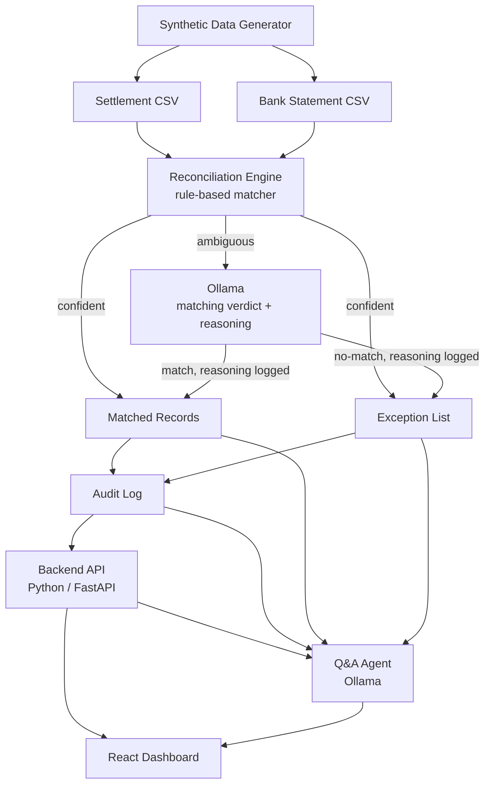

# AI Finance Controller — Project Plan

**Event:** Razorpay Individual Hackathon — Track 04, AI Finance Controller
**Builder:** Abhishek
**Time budget:** ~1 week+

---

## 1. What we're building

An agent that closes one finance-ops loop: reconciling Razorpay settlement
data against a bank statement, across a 50+ record synthetic batch — and
lets a user ask it plain-language questions about the results.

Two of the track's example directions, combined:

1. **Multi-source reconciliation** — match transactions across the two
   sources, report a match rate, and produce an honest list of exceptions
   (records that couldn't be auto-matched).
2. **Settlement Q&A agent** — a chat layer on top of that output, so a
   finance-ops user can ask things like *"why is today's payout short?"*
   and get an answer sourced from the actual data, not a guess.

### The bar we're building to (from the track brief)
- Throughput across the full batch, not a cherry-picked example.
- Measured accuracy — a real match rate, honestly reported.
- An honest exception list — records the system genuinely couldn't
  resolve, left for human review rather than force-matched.

---

## 2. Architecture

### 2.1 Component overview



### 2.2 Why it's shaped this way

- **The matcher is hybrid: rules first, Ollama for the ambiguous middle.**
  Explicit rules (amount, date, reference ID) resolve every confident case
  deterministically. Records the rules can't confidently call — the messy
  middle — go to Ollama, which reasons over both records and returns a
  verdict with its reasoning, logged into the audit trail. Full-LLM
  matching was ruled out: non-determinism and hallucinated "matches" would
  break the honesty bar the track scores on. Rules-only was also ruled
  out: it wastes the LLM and can't reason over free-text bank narration.
- **The Q&A agent only narrates.** The Ollama-backed Q&A agent reads the
  reconciliation engine's output (matches, exceptions, audit log) as its
  source of truth and answers questions about it — it never invents a
  number that isn't already in that data.
- **The audit log is the seam between backend and both frontends.** Every
  match, every exception, and every Q&A answer is logged with the record
  IDs it's based on — this is what makes "explainable and gated" possible,
  and it's also what the Q&A agent queries against.

### 2.3 Tech stack

| Layer | Choice | Notes |
|---|---|---|
| Backend | Python (FastAPI) | serves reconciliation results + audit log over REST |
| Matching engine | Python rules + Ollama for ambiguous cases | rules resolve confident cases; LLM verdicts on the rest, always logged with reasoning |
| LLM | Ollama | local small/medium model, or Ollama Cloud — chosen at runtime |
| Frontend | React (Vite) | dashboard + chat panel |
| Data | CSV | synthetic settlement report + bank statement, 50+ records |
| Audit log | JSON or SQLite | simple, inspectable, easy to query from the Q&A agent |

### 2.4 Suggested folder structure

```
project-root/
├── data/
│   ├── generate_synthetic_data.py
│   ├── settlement.csv
│   └── bank_statement.csv
├── backend/
│   ├── main.py              # FastAPI app
│   ├── reconcile.py         # matching engine
│   ├── audit.py             # audit log read/write
│   └── qa_agent.py          # Ollama integration + tool functions
├── frontend/
│   └── (React app: dashboard, exception list, chat panel)
├── docs/
│   ├── ADR-001-architecture.md
│   ├── glossary.md
│   └── PROJECT-PLAN.md
└── README.md
```

### 2.5 Data schema (proposed — confirm before Phase 1)

**settlement.csv**
| field | type | notes |
|---|---|---|
| settlement_id | string | Razorpay-side ID |
| reference_id | string | shared key for matching |
| amount | decimal | in ₹ |
| date | date | settlement date |
| status | string | e.g. settled, pending, reversed |

**bank_statement.csv**
| field | type | notes |
|---|---|---|
| txn_id | string | bank-side ID |
| reference_id | string | shared key for matching (may be noisy) |
| amount | decimal | in ₹ |
| date | date | bank-posted date, may drift 1-2 days from settlement date |
| narration | string | free-text bank description |

**matched / exception record (engine output)**
| field | type | notes |
|---|---|---|
| match_status | string | matched / exception |
| settlement_ref | string\|null | linked settlement_id |
| bank_ref | string\|null | linked txn_id |
| confidence | string | e.g. exact, fuzzy-date, fuzzy-amount, llm-reasoned |
| reason | string | why matched or flagged; for llm-reasoned rows, holds the LLM's reasoning text |

---

## 3. Phases

### Phase 0 — Setup
- Scaffold repo (structure above), Python venv, FastAPI skeleton, React app.
- Confirm Ollama setup (pull a local model, or configure Ollama Cloud
  credentials) and do a smoke-test call.
- **Exit check:** empty app runs end-to-end (backend serves a stub, frontend
  loads it).

### Phase 1 — Data schema & synthetic data
- Finalize the schema above.
- Write `generate_synthetic_data.py`: produce 50+ paired records with a mix
  of clean matches, near-matches (date drift, rounding), and deliberate
  non-matches (so the exception list has real content to report).
- **Exit check:** two CSVs generated, spot-checked by eye.

### Phase 2 — Reconciliation engine
- Implement rule-based matching: exact match first, then fuzzy tiers
  (date-tolerance, amount-tolerance).
- For records the rules can't confidently resolve, call Ollama with both
  records (including bank narration) for a match/no-match verdict with
  reasoning; log that reasoning into the audit trail.
- Anything neither rules nor the LLM can resolve falls to exceptions.
- Compute match rate.
- **Exit check:** engine runs on the full batch, produces matched list +
  exception list + match rate, with no manual intervention. Every
  LLM-assisted match is distinguishable from a rule match and has its
  reasoning logged.

### Phase 3 — Audit trail
- Log every match/exception decision with the source record IDs and the
  reason.
- Store in JSON or SQLite, queryable by record ID.
- **Exit check:** for any given output row, can trace back to exactly which
  input rows and rule produced it.

### Phase 4 — Backend API
- FastAPI endpoints: run reconciliation, fetch matches, fetch exceptions,
  fetch audit log, ask the Q&A agent a question.
- **Exit check:** all endpoints callable and returning real data via
  curl/Postman.

### Phase 5 — Q&A agent (Ollama)
- Integrate Ollama (local or cloud), give it tool access to query the
  audit log / matched / exception data.
- Test with real questions ("why is today's payout short?", "how many
  exceptions this batch?", "show me unmatched bank entries over ₹1000").
- **Exit check:** answers are grounded — every number in an answer traces
  back to a real record, not a guess.

### Phase 6 — Frontend dashboard
- Match rate summary, browsable exception list, chat panel wired to the
  Q&A endpoint.
- **Exit check:** a non-technical person could open the dashboard and
  understand the reconciliation state without reading code.

### Phase 7 — Integration & testing
- Run the full pipeline end-to-end on a fresh synthetic batch (acts as the
  held-out test — data the matching rules weren't tuned against).
- Report match rate, exception count, and a few sample Q&A exchanges
  honestly — no cherry-picking the best-looking batch.
- **Exit check:** numbers reported in the demo match what a stranger
  running the pipeline would get.

### Phase 8 — Demo prep & submission
- Write README (problem, architecture, how to run, metrics).
- Prepare a short demo script: show the dashboard, walk through one match
  and one exception with its audit trail, ask the Q&A agent 2-3 questions
  live.
- Submit.

---

## 4. Risks & mitigations

| Risk | Mitigation |
|---|---|
| Ollama too slow for live demo | Pre-warm the model before demo; have a fallback smaller local model |
| Matching rules tuned to fit one batch (looks good, isn't honest) | Always test on a freshly generated batch before reporting numbers |
| Reconciliation engine and Q&A agent both unfinished by deadline | Build reconciliation + dashboard first (working fallback demo); add Q&A agent only once that's solid |
| Frontend polish eats the whole week | Timebox frontend work; a plain but clear dashboard beats an unfinished fancy one |

---

## 5. Success criteria for demo day

- [ ] Match rate reported on a batch the rules weren't tuned against
- [ ] Exception list is real (not empty, not fabricated) with reasons
- [ ] Every match/exception traceable via audit log
- [ ] LLM-assisted matches are visibly distinct from rule matches, with reasoning logged
- [ ] Q&A agent answers 3+ real questions correctly, sourced from data
- [ ] Dashboard readable by someone who didn't build it