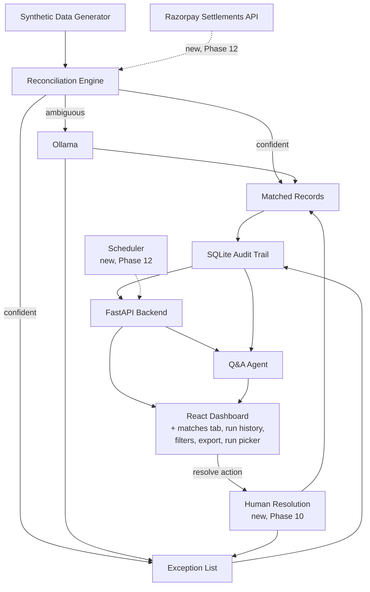

# AI Finance Controller — Project Plan v2.0

**Builds on:** v1.0 (`project_plan.md`, Phases 0–8, complete — see `CHANGELOG.md`)
**Goal for this version:** a genuinely deeper feature set — human-in-the-loop
review, a richer dashboard, real data ingestion, and the backend robustness
to support all of it — while staying a demo-able tool, not a
production-hardening exercise. Auth, multi-tenant, and horizontal scaling
are explicitly out of scope for v2.0.

---

## 1. What's changing from v1.0

v1.0 proved the core loop: reconcile honestly, explain every decision,
answer questions grounded in real data. v2.0 extends that loop in four
directions, in priority order:

1. **Backend robustness** — a real test suite and hardening, so the
   features below can be built on a safety net instead of manual re-checks.
2. **Human-in-the-loop** — exceptions aren't a dead end. A user can resolve
   one from the dashboard, and that resolution is a first-class, audited
   decision — as traceable as a rule match or an LLM match.
3. **Richer dashboard** — browse matches too (not just exceptions), see
   run history, filter/search, export, and trigger a run from the UI.
4. **New data capabilities** — real Razorpay settlement data as an
   alternative to synthetic CSVs, and scheduled/recurring runs.

---

## 2. Updated architecture

Every decision — rule, LLM, or now human — carries a `tier` in the audit
log (`rule` / `llm` / `human`), so the dashboard and Q&A agent can always
say *how* something was decided, not just *what* was decided.

---

## 3. Phases

### Phase 9 — Test suite & backend hardening

The foundation the rest of v2.0 gets built on.

- Real `pytest` suite. Seams to agree before writing any test (per the
  `/tdd` skill's process — this list is a starting proposal, not final):
  - `reconcile.run_reconciliation()` — pure function, already takes an
    injectable `llm_fn`, so the LLM tier is testable without real network
    calls
  - `llm_matcher.get_llm_verdict()`'s parsing/validation logic (the
    JSON-extraction and boolean-strictness fixes from the Phase 2/5 debugging
    passes are exactly the kind of regression this should guard forever)
  - `audit.py`'s save/list/get_trace functions against a temp SQLite file
  - FastAPI endpoints via `TestClient`
- Structured logging (replace `print()` with the `logging` module; the
  audit trail stays the source of truth for decisions, logging is for
  operational visibility — request timing, LLM call latency/failures)
- Retry/backoff on Ollama calls (currently single-shot; a transient network
  blip currently degrades a real match into an honest-but-avoidable
  exception)
- Configurable tolerances — `DATE_TOLERANCE_DAYS`/`AMOUNT_TOLERANCE_RS` move
  from hardcoded constants to environment/config, so the thresholds can be
  tuned without a code change
- **Exit check:** `pytest` runs in CI-style one command, covers the seams
  above, and a transient Ollama failure during the LLM tier no longer
  silently costs a real match.

### Phase 10 — Human-in-the-loop exception resolution

The dashboard's exception list currently ends at "here's why it's
unresolved." This phase closes that loop.

- `audit_log.tier` gains a third value: `human`, alongside `rule`/`llm`
- New endpoint: `POST /exceptions/{record_id}/resolve` — body: either
  `{"matched_record_id": "...", "note": "..."}` (link to a specific
  counterpart) or `{"resolution": "no_match", "note": "..."}` (confirm the
  exception stands, with a reason). Persists a new `audit_log` row,
  `tier: human`, and updates `match_status` accordingly.
- Dashboard: expanded exception rows gain a "Resolve" action — search/pick
  a counterpart record, or confirm no-match with a note
- `confidence` tag for these: `human-resolved`, visually distinct in the
  UI the same way `llm-reasoned` already is (this preserves v1.0's core
  principle — every tier stays honestly labeled, never blended together)
- Q&A agent: `get_trace` and `list_matches` already surface `tier` and
  `confidence`, so human-resolved records are automatically explainable
  without agent changes — verify this holds, don't assume it
- **Exit check:** resolving an exception from the dashboard produces a
  `tier: human` audit entry, immediately reflected in the match-rate stats
  and traceable via `/audit/{id}` exactly like a rule or LLM decision.

### Phase 11 — Richer dashboard — DONE

- **Matches tab** — a browsable, filterable matches view alongside
  Exceptions, filterable by confidence tier (exact / fuzzy-date /
  fuzzy-amount / fuzzy-date-amount / llm-reasoned / human-resolved),
  each row expandable to the same settlement/bank trace detail as an
  exception row
- **Run history** — `audit.list_matches`/`list_exceptions` enriched
  with real `amount`/`date` (LEFT JOIN onto `settlements`/
  `bank_entries`, since `audit_log` itself only carries refs) to make
  filtering possible; a hand-drawn SVG bar chart shows match-rate trend
  across runs, oldest to newest, next to the run picker (no charting
  library — consistent with the plain-CSS frontend)
- **Run picker** — a dropdown over `GET /runs` to view any past run's
  data, switching matches/exceptions/stats live
- **Filter/search** — amount range, date range, and settlement-vs-bank
  side (Exceptions only — Matches always have both sides), plus the
  confidence-tier chips, shared via one `FilterBar` component
- **CSV export** — client-side download of whatever's currently
  filtered/visible, on both tabs
- **Trigger-run button** — `POST /reconcile/async` + `GET
  /reconcile/status/{job_id}` (new, additive endpoints — the existing
  synchronous `POST /reconcile` is untouched for docs/tests/CLI
  parity): a background thread runs the real engine with a
  `progress_cb` reporting real stage/done/total counts (`rules` per
  settlement, `llm` per candidate reviewed, `persisting`), polled every
  500ms — a real progress bar, not a spinner
- **Exit check, verified live:** browsed both tabs with tier/amount/
  date/side filters combined, switched to an older run via the picker,
  exported a real CSV to disk, and triggered a genuine new
  reconciliation run (real Ollama calls) end-to-end from the dashboard
  with live progress — all without touching curl.

### Phase 12 — New data capabilities — CODE-COMPLETE, Razorpay path unverified live

Higher uncertainty than Phases 9–11 — scope depends on what's actually
available (Razorpay sandbox access, credentials, rate limits). No
credentials were available when this phase was built (see
docs/ADR-002) — the Razorpay loader and scheduled-reconciliation script
are implemented and unit-tested against Razorpay's real, observed API
contract (verified without credentials — see ADR-002), but the exit
check below remains unverified until real credentials exist. A third
capability, dashboard file upload, was added during this phase (user
request) and *is* fully verified live.

- **Razorpay Settlements API integration** — a new loader alongside
  `load_settlements()` (CSV) that fetches real settlement data via
  Razorpay's API, mapped into the same `Settlement` dataclass so the
  matching engine itself doesn't change. Bank statement ingestion stays
  CSV-based (or gains a parser for a specific bank's real export format)
  since there's no single "bank API" equivalent.
- **Scheduled reconciliation** — `backend/scheduled_reconcile.py`, a
  standalone script meant to be invoked by an external scheduler (cron,
  launchd, GitHub Actions cron) that runs the pipeline and prints a
  match-rate-delta digest. See ADR-002 for why an in-process scheduler
  was rejected in favor of this.
- **Dashboard file upload** (added, not in the original plan) — a
  user can upload their own settlement/bank CSVs from the dashboard's
  "Upload & Run" tab and trigger a run against them, via
  `POST /reconcile/upload`. Verified live end-to-end in a real browser.
- **Exit check:** the engine produces the same honestly-reported match
  rate / exception list / audit trail against real Razorpay data as it
  does against synthetic data — proving the matching logic itself
  generalizes beyond the synthetic generator's data shapes, not just
  beyond one synthetic seed (which Phase 7 already proved). **Not yet
  verified** — remains blocked on real Razorpay credentials; see
  docs/ADR-002's Consequences section for what verification looks like
  once they exist.

---

## 4. Risks & mitigations

| Risk | Mitigation |
|---|---|
| Test suite retrofit reveals a real bug in v1.0 code | Good outcome, not a setback — fix it, log it in `docs/BUILD-CHALLENGES.md` like every other bug found this project |
| Human resolution UI adds real complexity (search/pick a counterpart) | Start with the simpler "confirm no-match with a note" resolution path; add "link to a specific counterpart" once that's solid |
| Trigger-run button's ~20s LLM-tier latency feels broken in the UI | Real progress state (not a bare spinner) — e.g. poll `GET /runs` for the new run_id to appear, or move `/reconcile` to a background job with status polling if latency becomes the real bottleneck |
| Razorpay API access/credentials unavailable or rate-limited | Phase 12 is explicitly the most provisional phase; the synthetic-data path stays the default and fully functional regardless |
| Feature creep across 4 broad areas at once | Phases are ordered by dependency and risk (foundation → highest-value new capability → breadth → highest-uncertainty stretch) — build and ship phase by phase, same as v1.0, not all four areas in parallel |

---

## 5. Success criteria for v2.0

- [ ] `pytest` suite passes, covering the agreed seams
- [ ] A transient Ollama failure degrades gracefully with a retry, not an
      immediate honest-but-avoidable exception
- [ ] A user can resolve an exception from the dashboard, and that
      resolution is audited exactly as traceably as a rule/LLM decision
- [ ] Matches are browsable, not just exceptions
- [ ] Past runs are browsable and comparable, not just "latest"
- [ ] A new reconciliation run can be triggered from the dashboard with a
      real progress state
- [ ] (Stretch) the engine produces honest results against real Razorpay
      settlement data, not just synthetic CSVs
